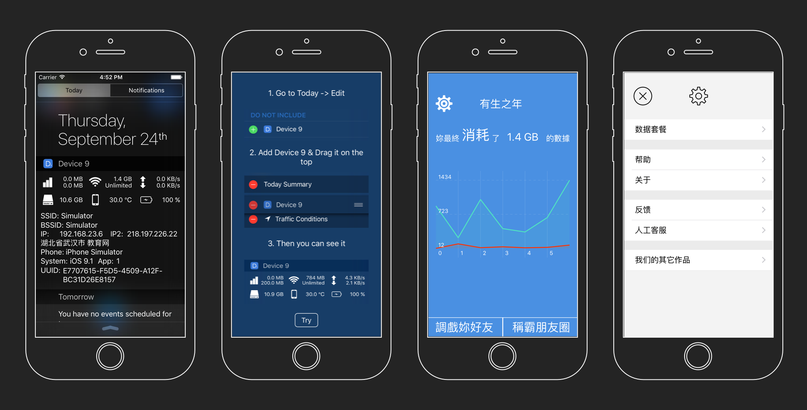
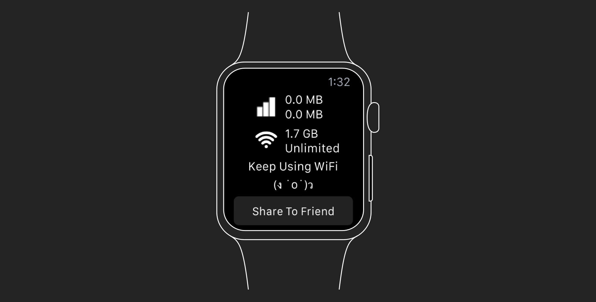
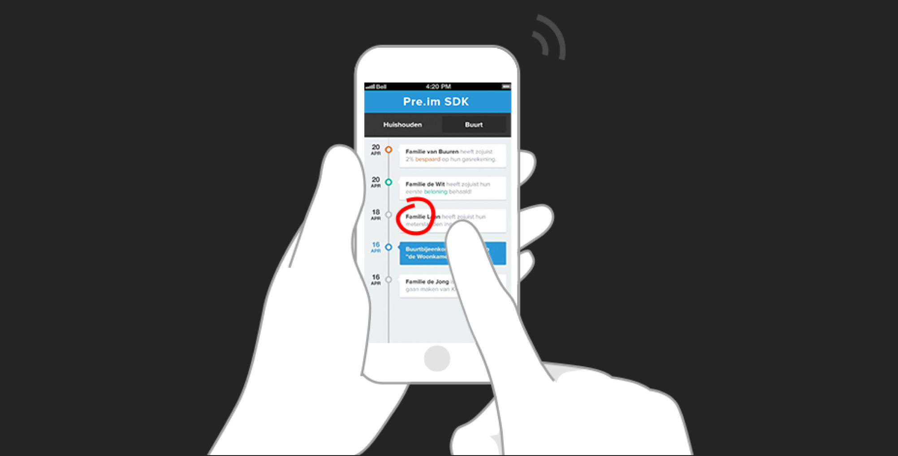

# Device-9     
实时监测网速，IP，内存大小，温度等设备信息并显示在通知中心的 iOS App

It's a iOS App for real-time monitoring of the network speed, IP address, memory size, temperature, etc. and its widget shows those info in the Today view.

Device Support: `iPhone 5s +` & `iOS 9.0 +` & `Apple Watch`, Download: http://pre.im/cctv

### 我只想静静地看看截图 / Screenshots

### Apple Watch

### Shake To Feedback
Now it's easily to feedback or report a bug by just shaking your phone. It automatically takes a screenshot and you can point out where it's going wrong and make notes to tell me.

